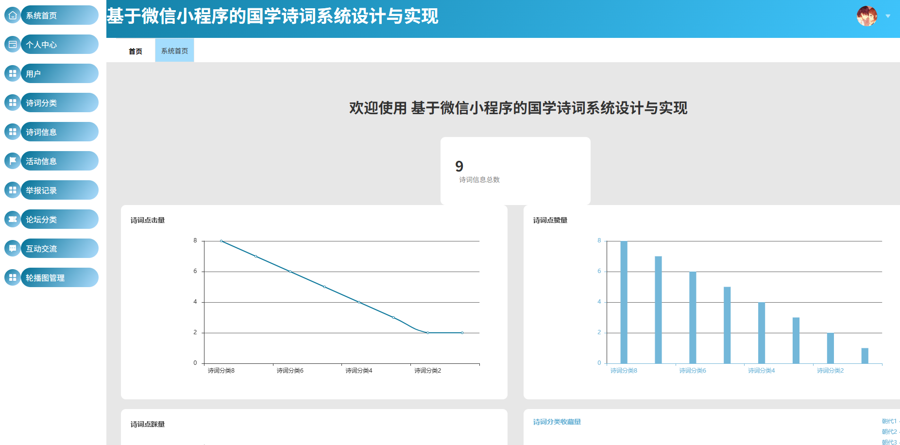
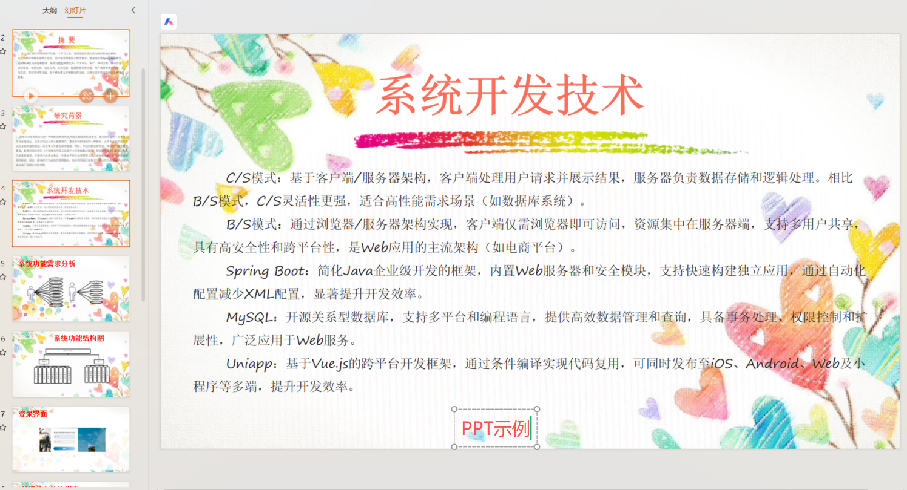

## 基于SpringBoot+uniapp的国学诗词系统+论文+开题报告+答辩PPT
> 基于SpringBoot+uniapp的国学诗词系统+论文+开题报告+答辩PPT。系统角色：管理员、普通用户 功能模块：用户管理、诗词分类、诗词信息、活动信息、举报信息、论坛信息、互助交流、轮播图管理等 技术选型：SpringBoot，Vue，uniapp等 测试环境：idea2024，jdk1.8，mysql5.7，maven3，node14.16.1
## 1.项目介绍
- 系统角色：管理员、普通用户
- 功能模块：用户管理、诗词分类、诗词信息、活动信息、举报信息、论坛信息、互助交流、轮播图管理等
- 技术选型：SpringBoot，Vue，uniapp等
- 测试环境：idea2024，jdk1.8，mysql5.7，maven3，node14.16.1
## 2.项目部署
### 2.1 后端部署
- 创建数据库，utf8mb4编码，排序：utf8mb4_general_ci，导入springbootz7l65e30/db下的sql文件
- idea打开目录springbootz7l65e30，根据本地数据库环境修改src/main/resources/application.yml   12-16行
- 启动项目src/main/java/com/SpringbootSchemaApplication.java
- 我已经帮大家将后端管理web项目编译好并打包，可以直接运行：http://localhost:8080/springbootz7l65e30/admin/dist/index.html，账号密码：admin/admin
### 2.2 后端管理web
- 管理web项目基于Vue，node版本是14.16.1。为了避免有的小伙伴执行npm install报错，我将node_modules也一并打包
- 通过idea（安装vue.js插件）或者webstorm、vscode等ide工具打开项目src/main/resources/admin/admin
- 进入终端，直接启动项目：npm run serve（node_modules我一并打包了，如果先给自己安装，可以先执行npm install）
### 2.3 小程序部署
- 通过微信开发工具，打开项目mp-weixin
- appid配置为你自己小程序的，或者你自己申请的测试小程序appid
- 信任项目即可，如果页面空白，重新编译下
- 说明：mp-weixin是uniapp项目编译后的，如果你想对小程序做一些修改，你可以通过HbuilderX打开springbootz7l65e30目录下的src/main/resources/front/front，这个是uniapp项目
## 3.项目部分截图

## 4.获取方式
[戳我查看](https://gitee.com/aven999/mall)
